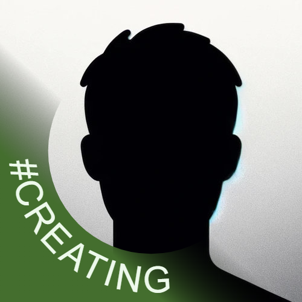

# LinkedIn profile badge

This is a tiny web app that puts a badged on your profile picture consistent with LinkedIn style but with your prefered text and colors.

👉[**Use it live**](https://badge.alexewerlof.com/)

## Why?

The profile picture is the first piece of information that people see.

LinkedIn currently (as of early 2024) only allows `#HIRED` and `#OPENTOWORK` in predefined colors.
There are [some claims](https://www.cnbc.com/2023/10/31/dont-use-linkedins-open-to-work-sign-says-former-google-recruiter.html)
that it hurts the job applicants to use the `#OPENTOWORK` badge.

Regardless of your opinion on the matter, the badge is a great place to spice up your online presence.

## How does it work?

This is a very simple application using vanilla JavaScript (no frameworks).

* The trick is to use a `<svg>` that overlays the image file that is loaded into an ``.
* Upon tweaking the settings a simple JavaScript function updates the relevant element in the `<svg>`.
* This also redraws a `<canvas>` element. The `<canvas>` is normally hidden (you can make it visible by commenting out the `display: none` in the CSS).
* Upon download, the contents of the `<canvas>` is converted to `image/png`, put in a the `href` attribute of a `<link>` which is then programmatically clicked
* The code is quick and dirty and I got a bit of help from [Copilot](https://github.com/features/copilot) too.

# How can I support you?

This app took about 5 hours to develop and test.
I addressed [my own needs](https://www.linkedin.com/in/alexewerlof/) via [inkscape](https://inkscape.org/) but I thought this is too good (and probably useful for job seekers) to keep it to myself. So I made this app to streamline the workflow without the need to install anything on your machine or having to learn any graphic design app.

If it saved you time, consider [subscribing to my newsletter](https://blog.alexewerlof.com/subscribe).

# I have ideas or suggestions

Please fork the repo and do whatever you like as long as it complies with the [license](LICENSE).

This is not my main engagement and unless there's a serious bug in it, I don't intend to touch it.

---

🇸🇪 Made in Sweden by [Alex Ewerlöf](https://alexewerlof.com/)